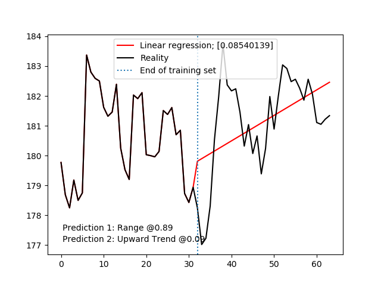

# CPAI

Artificial Intelligence for CryptoCurrency market prices predictions.

## Description

### Database

Recurrent Neural Network (Many-to-Many approach) based on historical
and social datas.

Number of hours to predict: 32.
Number of past hours for the prediction: 2048.

As of now, the algorithm is trying to predict Ethereum (ETH) prices
with the following features acquired through CryptoCompare's API:
- ETH historical data (open, close, high, low, volume from, volume to),
- BTC historical data (same as above as all cryptocurrencies are
strongly correlated to BTC),
- Social data (such as Github commits, tweets, facebook mentions, etc.).

With ETH's historical data, several indicators are computed to help
the RNN:
- Ichimoku Kinko Hyo (unshifted cloud, standard values),
- MACD,
- Bollinger Bands,
- Fourier Transforms (3, 6, 9, 100 components),
- ADX,
- Stochastic RSI.

After that all features are collected, a PCA is computed, and components
giving .99 of explained variance are kept. Let x be the number of components.

### Model

Currently used model is pretty basic. It's a stacked LSTM model taking
an input of shape (2048, x).

There are 4 Gated Recurrent Units (GRU) layers of 256, 128, 64 and 32
neurons each, with a parametric relu activation function connected 
to a Dense layer (output layer) of 32 neurons with a sigmoid activation
function.

As of now, the regressor is using a classical mean squared error loss
function, with a rmsprop optimizer, a batch size of 32 and 128 epochs.

*The model needs hyperparameters tuning.*

Here is the resulting prices array with historical price (left), and
prediction (right):

## Note

- Early and unstable,
- Basic RNN still not tuned,
- Integrating Google Trends is theoretically working, but pytrends' API isn't
working,
- History is heavily limited by the quantity of social data, but this is
related to CryptoCompare's API,
- PCA is linear, why not using KernelPCA or Autoencoders?
