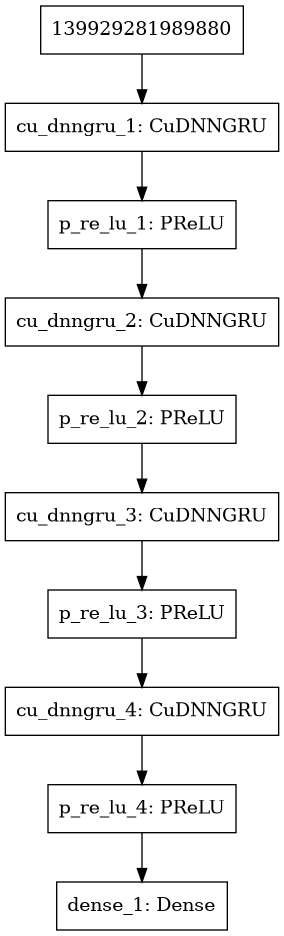

# CPAI

Artificial Intelligence for CryptoCurrency market trends predictions.

Current accuracy (5-fold Stratified Cross-Validation with PCA): 82%.

## Description

### Database

Recurrent Neural Network (Many-to-Many approach) based on historical
and social datas.

Number of hours to predict: 32.
Number of past hours for the prediction: 2048.

As of now, the algorithm is trying to predict Ethereum (ETH) prices
with the following features acquired through CryptoCompare's API:
- ETH historical data (open, close, high, low, volume from, volume to),
- BTC historical data (same as above as all cryptocurrencies are
strongly correlated to BTC),
- Social data (such as Github commits, tweets, facebook mentions, etc.).

With ETH's historical data, several indicators are computed to help
the RNN:
- Ichimoku Kinko Hyo (unshifted cloud, standard values),
- MACD,
- Bollinger Bands,
- Fourier Transforms (3, 6, 9, 100 components),
- ADX,
- Stochastic RSI.

After that all features are collected, a PCA is computed, and components
giving .99 of explained variance are kept. Let x be the number of components.

### Model

Currently used model is pretty basic. It's a stacked GRU model taking
an input of shape (2048, x).

There are 4 Gated Recurrent Units (GRU) layers of 128, 64, 32 and 32
neurons each, with a parametric relu activation function connected 
to a Dense layer (output layer) of 5 neurons with a softmax activation
function.

As of now, the classifier is using a classical Sparse Categorical 
Crossentropy loss function with Sparse Categorical Accuracy as metric,
with a rmsprop optimizer, a batch size of 64 and 64 epochs.

**The model is now a Classifier to reduce model complexity.**

The main goal changed: we do not try to predict future prices, but the
overall trend for the next hours. To do so, y_train is the slope of 
a linear regression over 32 hours. Classes are then defined as:
- 0, Very decreasing trend with slope <= mean(slopes)-a*std(slopes),
- 1, Decreasing trend with slope <= mean(slopes)-b*std(slopes),
- 2, Range with slope between mean(slopes) +/- c(std(slopes)),
- 3, Increasing trend with slope >= mean(slopes)+b*std(slopes),
- 4, Very Increasing trend with slope >= mean(slopes)+a*stp(slopes).

*The model needs hyperparameters tuning.*

Here is the resulting prices array with training historical price, and
the two most probable predictions (bottom left):

*WARNING: Example may not be up-to-dat in regard to the model while I'm
tunning it with k-fold crossvalidation.*

## Next step

## Note

- Early and unstable,
- Basic RNN still not tuned,
- Integrating Google Trends is theoretically working, but pytrends' API isn't
working,
- History is heavily limited by the quantity of social data, but this is
related to CryptoCompare's API,
- PCA is linear, why not using KernelPCA or Autoencoders?

## Used libraries

